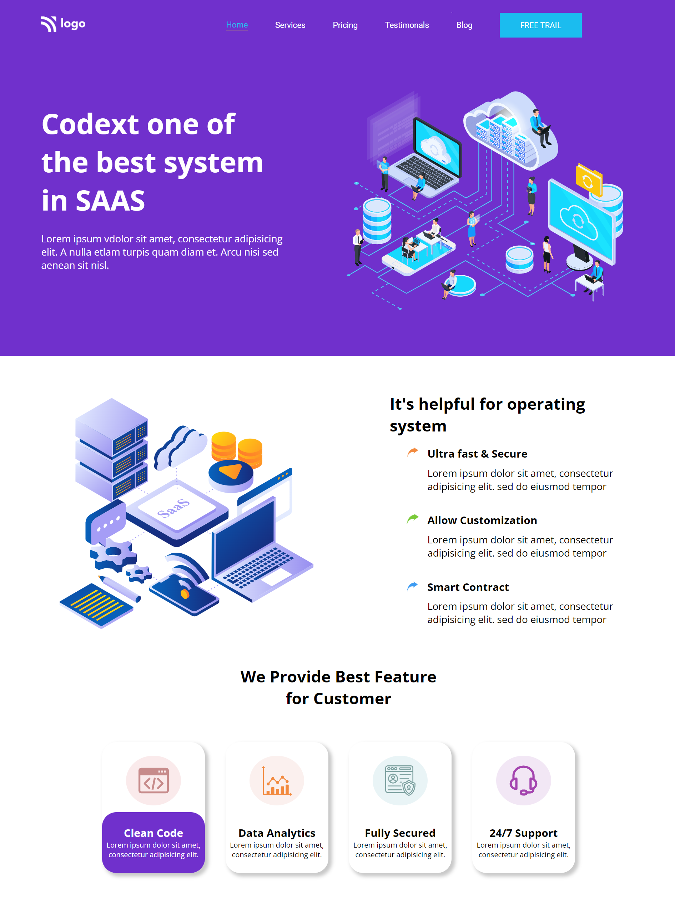
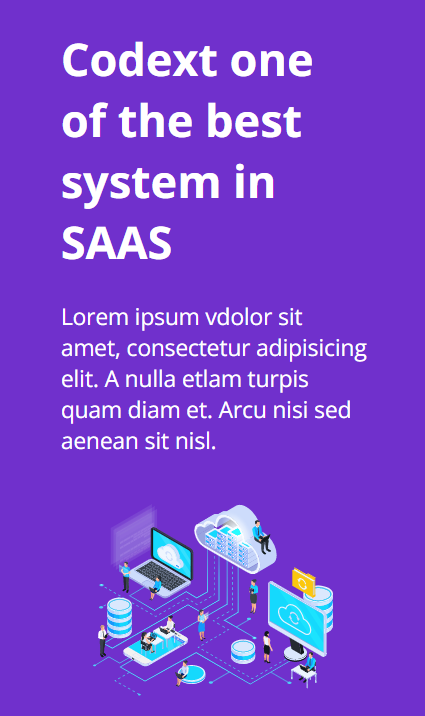
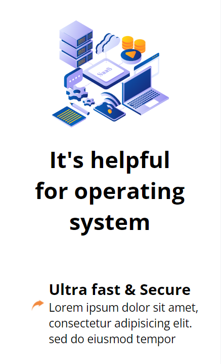
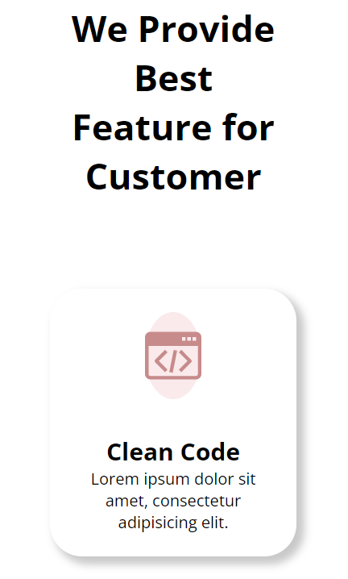

# SAAS LANDING PAGE PREVIEW

[saas.webm](https://user-images.githubusercontent.com/72256055/192190739-a7d3c616-5259-4bc5-9ba5-d221d8765fd8.webm)

# SAAS LANDING PAGE CLONE

**Name**: Aarya Nanndaann Singh M N

**Time**:  4 hours

**Concepts Explored**:

  Media Queries, Margin, Padding, Width, Background, Images and Couple more core concepts of CSS and HTML. 

### **Stack**:

## Metadata Of Project
**Site Type:** *STATIC*

**Responsive:** ✅

## What I Learnt

Here I got a chance to explore more about Core CSS concepts. Understood the work flow of the media queries and developing utility classes was a awesome experience. I explored width, padding, margin, background, position, background image, media-queries and a lot more core CSS concepts to get this project up and running😃.

## Live Link
**[Project in Action 🔥](https://saas-fsjs.netlify.app/)**

## Screenshots

